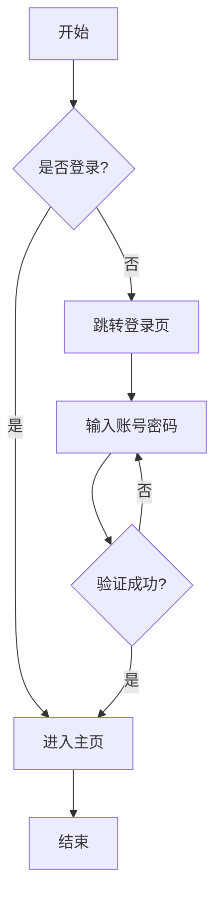
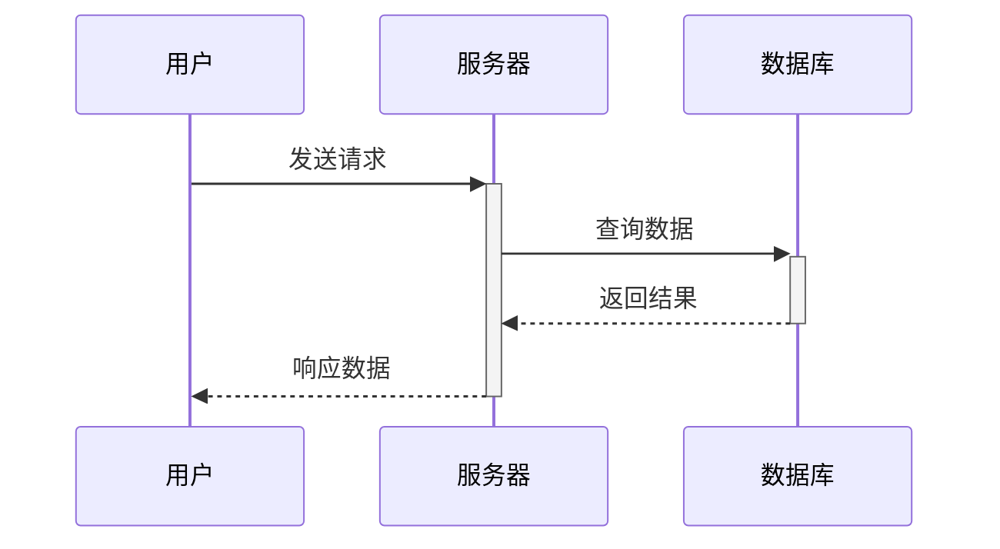
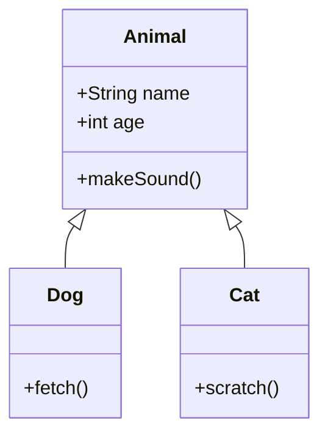
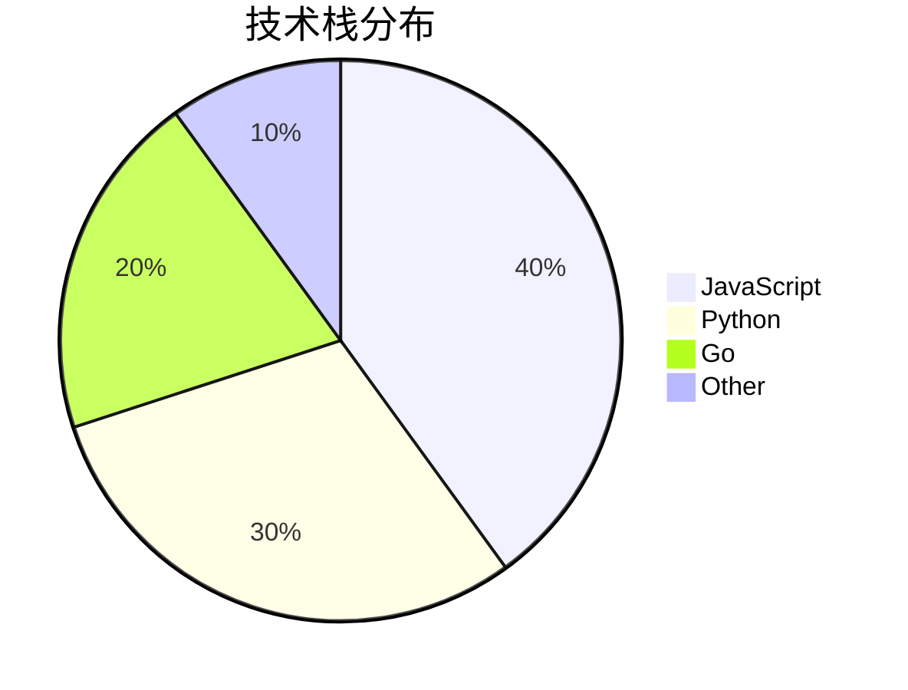

这是一篇用于测试 Markdown 语法的文章，涵盖常用的格式和元素。

<!-- more -->

## 标题测试

# 一级标题
## 二级标题
### 三级标题
#### 四级标题
##### 五级标题
###### 六级标题

---

## 文本格式

**粗体文本** 和 *斜体文本* 以及 ***粗斜体文本***

~~删除线文本~~

> 这是一段引用文本
> 可以有多行
>> 嵌套引用

---

## 列表

### 无序列表
- 项目一
- 项目二
  - 子项目 2.1
  - 子项目 2.2
- 项目三

### 有序列表
1. 第一步
2. 第二步
3. 第三步
   1. 子步骤 3.1
   2. 子步骤 3.2

### 任务列表
- [x] 已完成任务
- [ ] 未完成任务
- [ ] 另一个待办事项

---

## 代码

### 行内代码
使用 `console.log()` 打印日志。

### 代码块

```javascript
// JavaScript 示例
function greet(name) {
    return `Hello, ${name}!`;
}
console.log(greet('World'));
```

```python
# Python 示例
def fibonacci(n):
    if n <= 1:
        return n
    return fibonacci(n-1) + fibonacci(n-2)

print(fibonacci(10))
```

```bash
# Shell 命令
npm install hexo-cli -g
hexo init my-blog
cd my-blog
hexo server
```

---

## 链接和图片

### 链接
[GitHub](https://github.com)
[Hexo官网](https://hexo.io)

### 图片


---

## 表格

| 左对齐 | 居中对齐 | 右对齐 |
|:-------|:--------:|-------:|
| 内容1  | 内容2    | 内容3  |
| 数据A  | 数据B    | 数据C  |
| 文本X  | 文本Y    | 文本Z  |

---

## 分割线

使用三个以上的 `-` 或 `*` 或 `_` 创建分割线：

---

***

___

---

## 数学公式

行内公式：$E = mc^2$

块级公式：

$$
\sum_{i=1}^{n} x_i = x_1 + x_2 + \cdots + x_n
$$

更多公式示例：

$$
\int_{0}^{\infty} e^{-x^2} dx = \frac{\sqrt{\pi}}{2}
$$

$$
\begin{pmatrix}
a & b \\
c & d
\end{pmatrix}
$$

---

## HTML 嵌入

<details>
<summary>点击展开详情</summary>

这是隐藏的内容，点击上方可以展开或折叠。

- 支持 Markdown 语法
- **粗体** 和 *斜体*

</details>

<kbd>Ctrl</kbd> + <kbd>C</kbd> 复制

---

## Emoji 表情

:smile: :heart: :thumbsup: :star: :rocket:

（注：Emoji 显示需要主题或插件支持）

---

## Mermaid 图表

### 流程图



### 时序图



### 类图



### 饼图



---

## 脚注

这是一个带有脚注的句子[^1]。

[^1]: 这是脚注的内容。

---

## 总结

以上就是常用的 Markdown 语法，Hexo 配合主题可以完美渲染这些内容。如有特殊需求，可以安装额外的插件来扩展功能。
